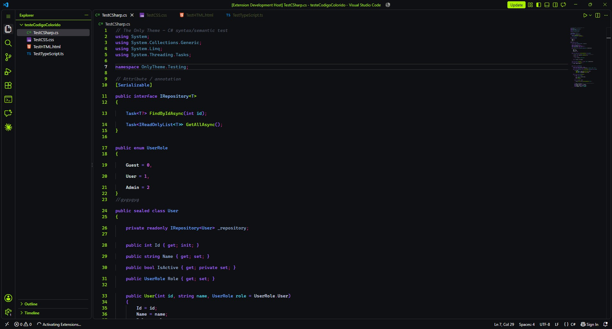
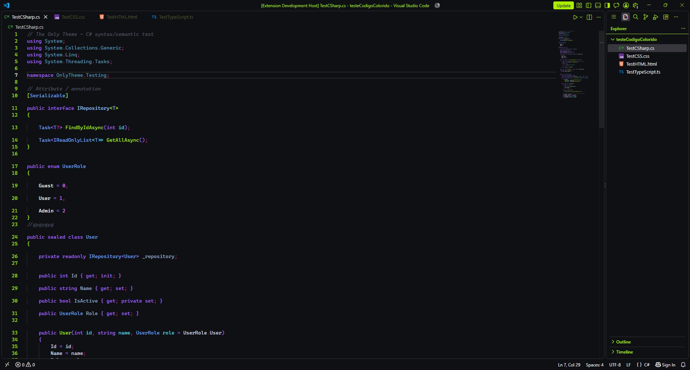

 

### Para muitos, a cor do tema não é tão relevante. Talvez seja apenas um upgrade visual para dar uma diferenciada na hora de codar. Eu não concordo com essa ideia.

Sou do tipo de programador que acredita que um bom tema faz diferença: motiva a produzir, traz conforto e torna o momento de programar mais agradável. É como olhar para o próprio quarto depois de deixá-lo limpo e organizado.

Por isso, decidi iniciar a versão beta daquele que pode ser o único tema capaz de me agradar completamente: o meu. Não é à toa que ele tem esse nome.

**The Only** traz uma experiência suave e, ao mesmo tempo, marcante. Única, eu diria. Um tema escuro, sofisticado, moderno e com uma certa nostalgia, criado para transformar o ambiente de desenvolvimento em um lugar onde dá vontade de ficar.

The Only te traz uma experiência suave e ao mesmo tempo marcante, única eu diria. Um tema escuro sofisticado, moderno e nostálgico.

## 🖼️ Previews

 Vscode padrão 

 Como eu prefiro 

## 🎨 Paleta de cores

A identidade do **The Only** gira em torno de um **verde-lima vibrante**, usado como cor de destaque sobre um fundo escuro quase preto. Para a sintaxe, a paleta combina **roxos, azuis, cianos, verdes e tons frios**, criando contraste e hierarquia sem deixar o código visualmente carregado.

A ideia é encontrar um equilíbrio entre **conforto para longas sessões de programação** e uma aparência marcante o suficiente para tornar a experiência diferente.

## 🧪 Beta & Contribuições

O **The Only ainda está em fase beta**. Este é um projeto que estou iniciando e também uma oportunidade para aprender mais sobre a criação e manutenção de temas para o VS Code.

Por isso, **feedbacks, sugestões, novas paletas de cores, melhorias de contraste e correções de bugs são muito bem-vindos**. A ideia é continuar refinando o tema com o tempo e, quem sabe, fazer dele uma experiência que também agrade outras pessoas além de mim.

Se encontrar algum problema ou tiver uma ideia para melhorar o tema, sinta-se à vontade para abrir uma **Issue** ou contribuir com o projeto.

 

